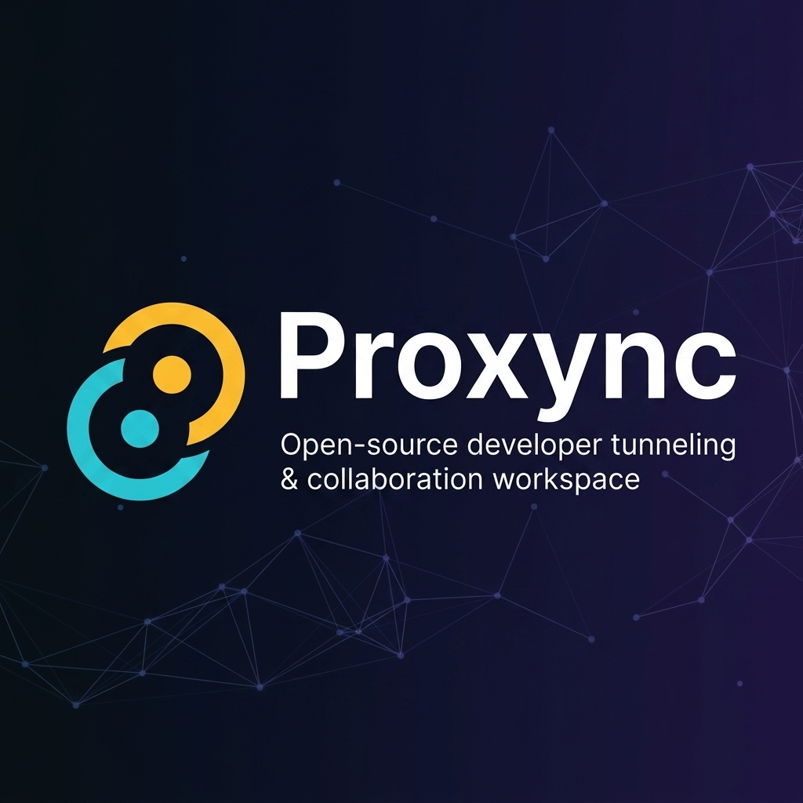

<p align="center">
  
</p>

<p align="center">
  <strong>Open-source developer tunneling & real-time collaboration workspace.</strong><br/>
  <sub>Expose your local server to the internet in seconds. Inspect traffic. Collaborate with your team — all from one app.</sub>
</p>

<p align="center">
  <a href="https://github.com/Inilax/Proxync/stargazers"></a>
  <a href="https://github.com/Inilax/Proxync/blob/main/LICENSE"></a>
  <a href="https://github.com/Inilax/Proxync/issues"></a>
  <a href="https://github.com/Inilax/Proxync/pulls"></a>
</p>

<p align="center">
  
  
  
  
  
  
  
  
  
</p>

---

## 🤔 What is Proxync?

**Proxync** is an open-source, self-hostable alternative to [ngrok](https://ngrok.com/) — but built for teams. Start your local dev server, click **Share**, and hand out a public URL. Your teammate sees the live, running build — complete with **real-time traffic inspection**, **Swagger docs generation**, **Postman-like request runner**, and **live chat** — all without leaving the app.

> **Think of it as:** _ngrok + Postman + Swagger UI + team chat — unified in a single native desktop app._

<br/>

## ✨ Features

<table>
  <tr>
    <td width="50%">

### 🔗 Instant Tunneling
Expose any local port to the internet with a single click. Supports **Localtunnel** (free public HTTPS), **LAN sharing** (WiFi teammates), and **custom domain** binding with DNS verification.

### 🔍 Live Traffic Inspector
Every HTTP request flowing through your tunnel is captured, timestamped, and displayed in real-time — including full headers, body payloads, status codes, and response times.

### 📖 Auto Swagger Docs
Proxync watches your traffic patterns and auto-generates an **OpenAPI specification** from observed requests. Browse your API docs without writing a single YAML line.

</td>
<td width="50%">

### 🧪 Built-in Postman
Craft and replay HTTP requests directly from the app. Save request collections, import from traffic captures, and share them with your team.

### 💬 Real-time Chat & Presence
Each workspace comes with live text channels, presence indicators, and screenshot sharing. No need to context-switch to Slack when debugging together.

### 🌐 Custom Domain Support
Register your own domains (e.g. `api.yourcompany.com`), verify ownership via DNS TXT records, and bind them directly to your tunnels — like a mini Vercel for development.

</td>
  </tr>
</table>

<br/>

## 🏗️ Architecture

```
                                    ┌─────────────────────────────────┐
                                    │        Public Internet          │
                                    │   (Localtunnel / Custom DNS)    │
                                    └──────────────┬──────────────────┘
                                                   │ HTTPS
                                                   ▼
┌──────────────────────┐          ┌─────────────────────────────────────┐
│   Tauri Desktop App  │◄────────►│         NestJS API Gateway          │
│                      │    WS    │                                     │
│  ┌────────────────┐  │  Relay   │  ┌───────────┐  ┌───────────────┐  │
│  │  React + Vite  │  │◄────────►│  │  Relay    │  │  REST API     │  │
│  │  (Frontend UI) │  │          │  │  Gateway  │  │  Controllers  │  │
│  └────────────────┘  │          │  │  (WS)     │  │               │  │
│  ┌────────────────┐  │          │  └───────────┘  └───────────────┘  │
│  │  Rust Agent    │  │          │  ┌───────────┐  ┌───────────────┐  │
│  │  (Port Scan,   │  │          │  │  Prisma   │  │  Redis        │  │
│  │   WS Client,   │  │          │  │  (ORM)    │  │  (PubSub)     │  │
│  │   LT Spawner)  │  │          │  └─────┬─────┘  └───────────────┘  │
│  └────────────────┘  │          │        │                            │
└──────────────────────┘          └────────┼────────────────────────────┘
                                           │
                                  ┌────────▼────────┐
                                  │  PostgreSQL 16   │
                                  │  (via Docker)    │
                                  └─────────────────┘
```

<br/>

## 📂 Project Structure

```
proxync/
├── packages/
│   ├── api/                   # NestJS backend — REST API, WebSocket relay, Prisma ORM
│   │   ├── prisma/            #   Database schema & migrations
│   │   └── src/
│   │       ├── auth/          #   JWT auth, session rotation, bearer guards
│   │       ├── relay/         #   WebSocket tunnel gateway & HTTP proxy middleware
│   │       ├── tunnels/       #   Tunnel lifecycle management & subdomain generation
│   │       ├── domains/       #   Custom domain registration & DNS verification
│   │       ├── requests/      #   Request capture, logging, and replay engine
│   │       ├── channels/      #   Real-time chat room management
│   │       ├── messages/      #   Text & screenshot messaging
│   │       └── workspaces/    #   Multi-tenant workspace orchestration
│   │
│   ├── desktop/               # Tauri 2 desktop app — native cross-platform client
│   │   ├── src-tauri/src/     #   Rust backend: port scanner, WS relay, localtunnel spawner
│   │   └── src/               #   React frontend: traffic view, postman, swagger, chat
│   │       ├── components/    #     Modular UI widgets
│   │       ├── screens/       #     Full-page workspace views
│   │       └── lib/           #     API client, types, utilities
│   │
│   └── web/                   # (Planned) Public browser viewer for shared tunnels
│
├── docker-compose.yml         # PostgreSQL & Redis infrastructure
├── .agents/                   # AI agent configuration & architecture docs
└── package.json               # npm workspaces root
```

<br/>

## 🚀 Quick Start

### Prerequisites

| Tool | Version | Purpose |
|------|---------|---------|
| **Node.js** | ≥ 20 | Runtime for API & frontend |
| **npm** | ≥ 10 | Package management (workspaces) |
| **Docker Desktop** | Latest | PostgreSQL & Redis containers |
| **Rust** | Latest stable | Tauri desktop app compilation |

### 1. Clone & Install

```bash
git clone https://github.com/Inilax/Proxync.git
cd proxync
npm install
```

### 2. Start Infrastructure

```bash
docker-compose up -d
```

> This launches **PostgreSQL** on port `5432` and **Redis** on port `6379`, plus **Adminer** (DB GUI) on port `8080`.

### 3. Configure Environment

```bash
cp packages/api/.env.example packages/api/.env
```

Ensure `DATABASE_URL` and `REDIS_URL` point to your local Docker instances.

### 4. Setup Database

```bash
cd packages/api
npx prisma db push
```

### 5. Run the API Server

```bash
cd packages/api
npm run dev
```

> API runs on `http://localhost:3939` — Swagger docs at `http://localhost:3939/api`

### 6. Launch the Desktop App

```bash
cd packages/desktop
npm run tauri dev
```

> Vite dev server runs on `http://localhost:1420`. Tauri compiles the Rust agent and opens the native window automatically.

<br/>

## 🧭 How It Works

1. **Discover** — The Rust agent scans your machine for running HTTP services (ports with active listeners).
2. **Share** — Pick a process, choose an exposure method (LAN, Localtunnel, or Custom Domain), and click **Go Live**.
3. **Tunnel** — A WebSocket relay connection is established between the Tauri agent and the NestJS gateway. All HTTP traffic is proxied through this encrypted pipe.
4. **Capture** — Every request/response pair is logged in real-time to the Traffic Inspector with full headers, body, timing, and status.
5. **Collaborate** — Team members join the workspace, browse the auto-generated Swagger docs, replay requests in the built-in Postman, and discuss findings in the live chat.

<br/>

## 🛠️ Tech Stack

| Layer | Technology | Role |
|-------|-----------|------|
| **Desktop Shell** | Tauri 2 (Rust) | Native window, port scanning, WebSocket client, Localtunnel process spawner |
| **Desktop UI** | React + TypeScript + Vite | Traffic inspector, Postman, Swagger viewer, chat panel |
| **API Gateway** | NestJS (TypeScript) | REST controllers, WebSocket relay gateway, HTTP proxy middleware |
| **Database** | PostgreSQL 16 + Prisma ORM | Users, workspaces, tunnels, request logs, channels, messages |
| **Cache / PubSub** | Redis 7 | Presence tracking, real-time event broadcasting |
| **Styling** | Vanilla CSS | Custom dark theme with CSS variables, glassmorphism, micro-animations |

<br/>

## 🤝 Contributing

We welcome contributions from the community! Whether it's a bug fix, new feature, documentation improvement, or UI polish — every contribution matters.

### Getting Started

1. **Fork** the repository
2. **Create** a feature branch: `git checkout -b feature/main-your-feature-name`
3. **Make** your changes and ensure they compile:
   ```bash
   # API
   cd packages/api && npm run build

   # Desktop (TypeScript check)
   cd packages/desktop && npm run build
   ```
4. **Commit** with a descriptive message following [Conventional Commits](https://www.conventionalcommits.org/):
   ```
   feat(api): add webhook notification support
   fix(desktop): resolve tunnel reconnection on network change
   ```
5. **Push** and open a **Pull Request**

### Development Guidelines

- 📖 Read `packages/api/prisma/schema.prisma` before making any data model changes
- 🔒 Any controller using `@UseGuards(BearerGuard)` must import `AuthModule`
- ⚡ Avoid `redis.keys()` in production paths — use in-memory maps or `SCAN`
- 🦀 Never block the Tauri main thread in Rust — use `tokio::spawn` for async work
- 📝 Update the [changelog](.agents/changelog.json) when adding significant features

<br/>

## 📋 Roadmap

- [x] Core tunneling infrastructure (WebSocket relay, port scanning)
- [x] Live traffic inspector with request/response capture
- [x] Auto-generated Swagger/OpenAPI documentation
- [x] Built-in Postman (request runner & collections)
- [x] Real-time chat channels & presence
- [x] Custom domain registration & DNS verification
- [x] Localtunnel integration (free public HTTPS URLs)
- [x] LAN sharing (WiFi local network access)
- [ ] Voice rooms (WebRTC signaling via relay)
- [ ] Browser-based tunnel viewer (public web client)
- [ ] Unread message badges & OS notifications
- [ ] Team invite flow & shareable workspace links
- [ ] Rate limiting & bandwidth usage dashboards
- [ ] Plugin system for custom middleware

<br/>

## 📄 License

This project is open source and available under the [MIT License](LICENSE).

<br/>

---

<p align="center">
  
</p>

<p align="center">
  <sub>Built with ❤️ by <a href="https://github.com/Inilax">Inilax</a></sub><br/>
  <sub>
    <a href="https://github.com/Inilax/Proxync/issues">Report Bug</a> · 
    <a href="https://github.com/Inilax/Proxync/issues">Request Feature</a> · 
    <a href="https://github.com/Inilax/Proxync/discussions">Discussions</a>
  </sub>
</p>
